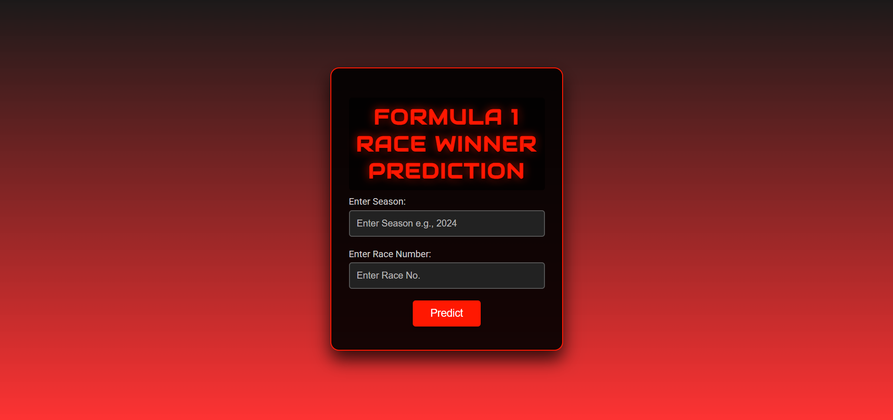

# 🏁 Formula 1 Winner Predictor

Welcome! I’m Nirvaan, and this is my project to predict Formula 1 race winners by combining real-time data and machine learning. Using the Ergast API, the app analyzes current race statistics and driver performance to make informed predictions on upcoming races. The web app is built with Python (Flask) and uses a Random Forest machine learning model under the hood.

---

## 🚀 Highlights

- **Real-Time Insights:** Fetches up-to-date race data using the [Ergast Developer API](https://ergast.com/mrd/)
- **Comprehensive Analysis:** Considers driver stats, team strength, and track features
- **Predictive Power:** Utilizes a Random Forest model to forecast winners
- **Interactive Web App:** Easy-to-use Flask web interface for quick predictions

---

## 🖥️ Project Demo




1. **Home Page:** Enter the F1 season and race number.
2. **Prediction:** The app fetches live data, runs the prediction model, and displays the expected winner and team.

---

## ⚡ Quickstart

1. **Clone the Repo**
    ```
    git clone [https://github.com/Nirvaan05/F1-Winner-Predictor-]
    cd Formula1_project
    ```

2. **Install Dependencies**
    - Ensure you have Python 3.8+ installed.
    ```
    pip install -r requirements.txt
    ```

3. **Run the App**
    ```
    python app.py
    ```
    - Open [http://127.0.0.1:5000](http://127.0.0.1:5000) in your browser.

---

## 📝 How to Use

1. Visit [http://127.0.0.1:5000](http://127.0.0.1:5000)
2. Enter the **season** (e.g., 2024) and **race number** (e.g., 5)
3. Click **Predict**
4. The predicted Grand Prix winner and team will be displayed

---

## 🛠️ Troubleshooting

- **API Connection Problems:**  
  Can’t fetch data? Double-check your internet or firewall. Wait a few minutes and try again.
- **Blank Results:**  
  Ensure the Ergast API is reachable. Any errors should appear on the results page.

---

## 📚 Data References

- [Ergast Developer API](https://ergast.com/mrd/)
- Local F1 CSV datasets (included)

---

## 💡 Tech Stack

- Python 3
- Flask
- Pandas
- scikit-learn (Random Forest)
- HTML/CSS & Jinja2 templates

---

## 📜 License

This project is for educational, experimentation, and demonstration purposes only.

---

## 🙏 Credits

- Huge thanks to [Ergast Developer API](https://ergast.com/mrd/) for providing the F1 data backbone!
- Appreciation to the Formula 1 community for inspiration and resources

---

Pull over for a star, overtake with a fork, and let’s take this project to the podium! 🏆


